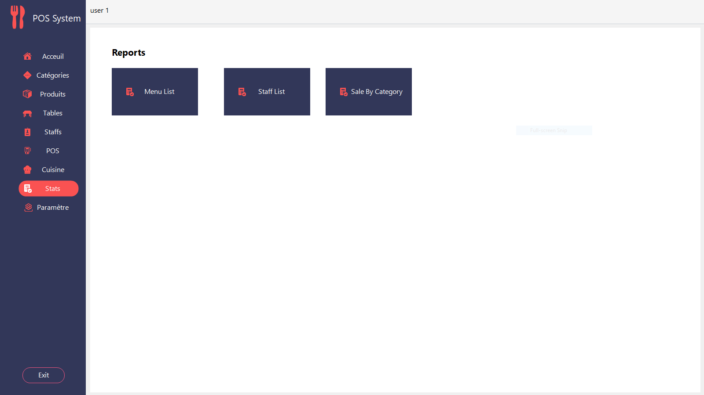
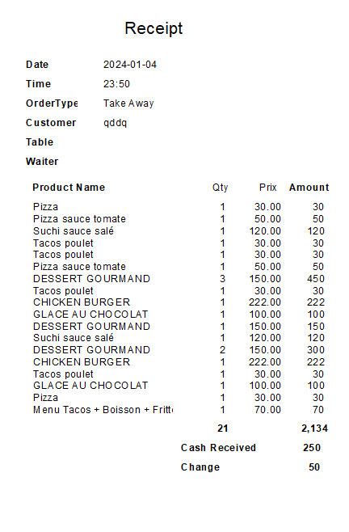

# Restaurant Management System (Desktop App) 🖥️🍽️

A desktop-based restaurant management system built using **C# and .NET Framework**. This project was designed to handle the day-to-day operations of a restaurant: managing orders, tables, menus, users, and more.

> ✅ This is the original version of the system, which inspired the web-based version now hosted on [Vercel](https://mohamedyehiyakoita.vercel.app).

---

## 🎯 Key Features

- User authentication (admin & staff roles)
- Menu and category management
- Table booking system
- Order processing and billing
- Reporting system
- Intuitive graphical interface (WinForms)
- Local database (SQL Server)

---

## 🧰 Tech Stack

- **Language**: C#
- **Framework**: .NET Framework (WinForms)
- **Database**: Microsoft SQL Server
- **IDE**: Visual Studio

---

## 📸 Screenshots

### 🔐 Login
.png)

### 📊 Dashboard
.png)

### 🍽️ POS System
.png)

### 📋 Order List
.png)
.png)

### 🍳 Kitchen Management
.png)
.png)

### 📈 Statistics
)

### 🧾 Invoice View
)

### ❌ Error Login
.png)

---

## 📁 Project Structure

Restaurent-Management-system/
├── bin/

├── obj/

├── Forms/

│ ├── Dashboard.cs

│ ├── Login.cs

│ └── ...

├── Program.cs

└── Restaurent-Management-system.csproj

---

## 🔗 Related Project

A modern web version of this app is under development:  
👉 [Web RMS on GitHub](https://github.com/MYK-OTAKU/MyNewApp)  
🌐 [Live Preview (Guest Login)](https://mohamedyehiyakoita.vercel.app)  
🧑‍💻 **Username**: `Guest`  
🔐 **Password**: `123`

---

## 📬 Contact

- **GitHub**: [MYK-OTAKU](https://github.com/MYK-OTAKU)
- **LinkedIn**: [Mohamed Yehiya Koïta](https://www.linkedin.com/in/mohamed-yehiya-koita)

---

## 📜 License

This project is for educational and demonstration purposes.
